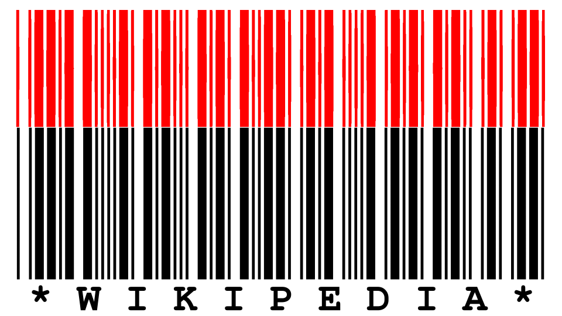

# wavcode - Create encode a message in a barcode  as a waveform

To encode the word Wikipedia, just execute the binary `wavecode -t "*Wikipedia*"` or `cargo run -- -t "*Your text here*"` if you are building from source.
The output is stored in `out.wav`by default and can be changed with the flag `-o`.
For help, just call `--help`.

## But why?!
This is not intended to be used in any serious context.
I created this as a simple steganography challenge for a series of riddles.


## Inspecting the result
The `*Wikipedia*` example can be expected by calling:

```bash
ffmpeg -i out.wav \
	-filter_complex "aformat=channel_layouts=mono,showwavespic=s=1000x400" \
	-frames:v 1 \
	barcode.png
```

The waveform of an audiofile does not specify an aspect ratio by default.  
Hence, some experimentation has to be done to find the correct dimension to render.  
A simple trick to align the results is to generate a valid Code 39 barcode and align the images to have the same width.

### Output
Wikipedia as a Code 39 barcode. In red the output of wavecode -> ffmpeg. In black the example from the [wikipedia page about code 39](https://en.wikipedia.org/wiki/Code_39).

